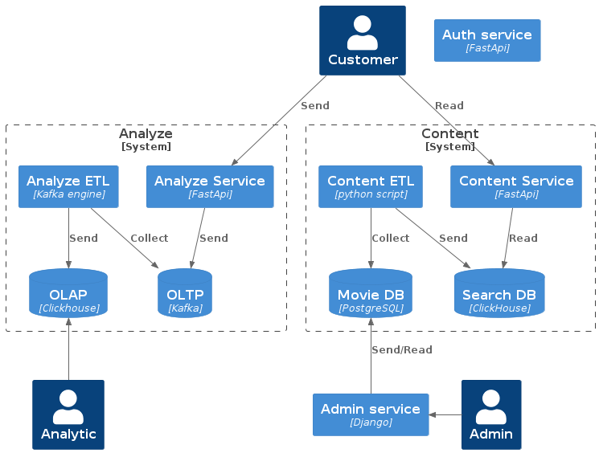

# Описание

UGC-сервис для сбора пользовательских действий и дальнейшей аналитики.

# Авторы
* [@likeinlife](https://github.com/likeinlife)
* [@maxim-zaitsev](https://github.com/maxim-zaitsev)
* [@yandexwork](https://github.com/yandexwork)

# Вклад @likeinlife

- ETL Kafka -> Clickhouse
- Kafka, Apache Spark research
- Tests

# Вклад @maxim-zaitsev

- docker-compose file
- Clickhouse, Vertica research

# Вклад @yandexwork

- UGC API
- nginx

# Запуск/остановка
- make up - запуск
- make down - удалить созданные контейнеры
- make downv - удалить созданные контейнеры, включая volumes

# Тестирование
1. `cd tests`
2. `make test`

# Адрес
- общий: http://localhost
- openapi: http://localhost/api/openapi

# Сущности
1. Клики: пользователь(id), элемент, timestamp
2. Просмотр страниц: пользователь(id), страница, сколько времени проведено, timestamp
3. Кастомные сущности: пользователь(id), событие, детали события, timestamp,

Возможные события:
   - смена качества видео(переключение с какого на какое качество?)
   - просмотр видео до конца(какого видео?)
   - использование фильтра поиска(по какому фильтру(ам)? какое значения фильтра?)

# Нефункциональные требования
1. Масштабируемость(обеспечение устойчивой работы при увеличении нагрузки)
2. Производительность(скорость отклика ниже 200мс)
3. Надежность:
   1. Для записи: 99.8%
   2. Для аналитики: 90%(не гарантируется ночная работа)

# Функциональные требования
## Для клиента
- Ручки для отправки информации по сущностям(разные ручки):
   1. клики
   2. просмотр страницы
   3. кастомные сущности
## Для аналитика
- Возможность получить и проанализировать информацию из ClickHouse

# Сервисы

